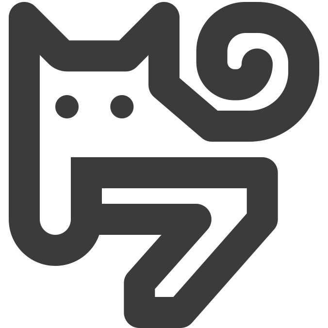

<div align="center">

# 墨七科技  Mo7 Tech

**陕西墨七数字科技有限公司 · 官方开源组织**  
_Design-Driven Engineering & Independent Game Lab._

[](https://mo7tech.com)
[](https://mo7tech.com)
[](mailto:hi@mo7tech.com)

</div>

---

### 💡 关于我们 / About Us

**墨七科技 (Mo7 Tech)** 是一家专注于“产品设计 × 全栈工程”双重交付的独立技术工作室与游戏研发团队。我们秉持严谨的工程思维与现代审美，既为企业提供覆盖多端的高标准数字化解决方案，也致力于打造独具特色的独立游戏。

> _"Bridging code precision, product aesthetics, and interactive entertainment."_

---

### 🎮 旗下游戏品牌与生态矩阵 / Game Brands & Ecosystem

| 品牌 / 资产             | 官方域名                             | 品牌定位与核心方向                                                     |
| :---------------------- | :----------------------------------- | :--------------------------------------------------------------------- |
| **墨七科技 (Mo7 Tech)** | [mo7tech.com](https://mo7tech.com)   | 公司主站、商业全栈定制交付、企业数字化升级与 AI 方案落地               |
| **比特喵 (BitMeow)**    | [bitmeow.net](https://bitmeow.net)   | **休闲治愈游戏厂牌**：主打桌面挂机、农场种田模拟、萌系像素与陪伴类游戏 |
| **万物指令 (ArrayCmd)** | [arraycmd.com](https://arraycmd.com) | **硬核向独立游戏厂牌**：主打科幻策略、系统模拟、极客解谜与战术类游戏   |

---

### 🛠️ 核心业务能力 / Capabilities

- **💻 Web 全栈与企业级后台**: 现代 Web 应用、高可用 API 网关、企业业务中台及数字化系统全栈交付。
- **📱 移动端与微信小程序**: 覆盖 **iOS / Android / HarmonyOS** 的跨端及原生 App 定制，提供全套微信小程序生态解决方案。
- **🖥️ 跨平台桌面客户端开发**: 基于 **Avalonia / .NET** 技术栈，打造高性能、现代 UI 界面的 **Windows / macOS / Linux** 桌面生产力工具与行业客户端。
- **🎨 UI/UX 体验与视觉设计**: 产设研深度一体化，提供交互逻辑梳理、高保真界面设计与规范化 Design System 落地。
- **🤖 AI 智能化场景落地**: 企业私有知识库搭建、业务自动化 Agent 智能体调度与场景化辅助工具。
- **🕹️ 独立游戏全流程研发**: 跨平台玩法原型设计、Unity / Godot (C#) 引擎核心研发及全平台发行支持。

---

### 🧰 核心技术栈 / Core Tech Stack

```text
Languages & Core  : TypeScript, JavaScript, C#, .NET, ArkTS (HarmonyOS), HTML5, CSS3/Tailwind
Client & Desktop  : Avalonia (Cross-platform UI), Vue.js, React, Astro, Mini-Program
Backend & Cloud   : ASP.NET Core, Node.js, Docker, Linux, Caddy/Nginx, PostgreSQL, Redis
Game Development  : Unity / Godot (C#), HLSL/Shaders, Game Math & Logic
```

---

### 📬 商务合作与技术咨询 / Contact

无论您需要企业数字化方案定制、移动端/鸿蒙/小程序研发、Avalonia 桌面端开发外包，或寻求独立游戏业务合作，欢迎联络：

- **官方主站**: [https://mo7tech.com](https://mo7tech.com)
- **联络邮箱**: [hi@mo7tech.com](mailto:hi@mo7tech.com)

---

<div align="center">
  <sub>© 2026 陕西墨七数字科技有限公司 (Shaanxi Mo7 Digital Technology Co., Ltd.) All rights reserved.</sub>
</div>
